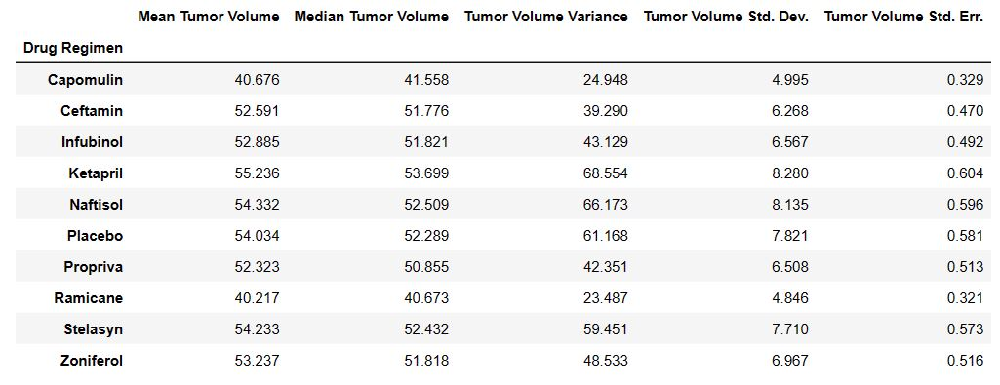
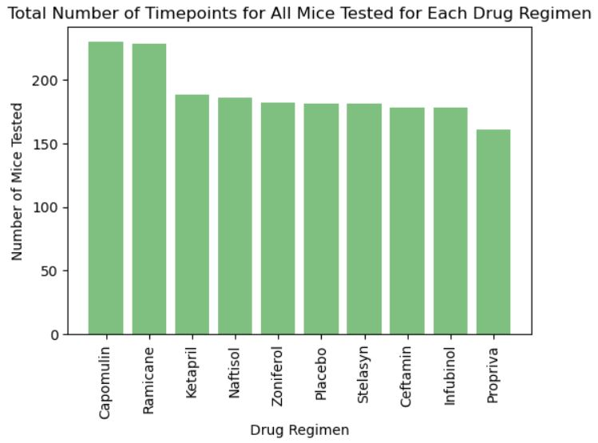
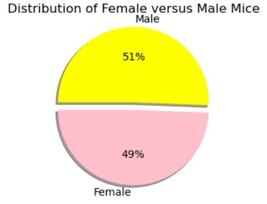
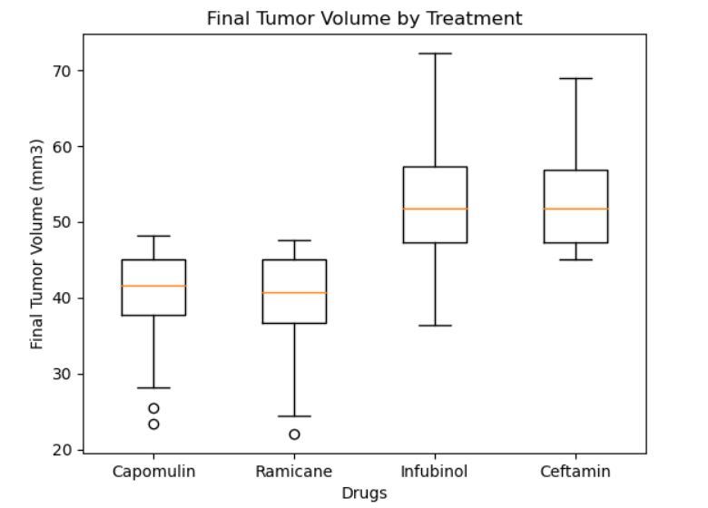
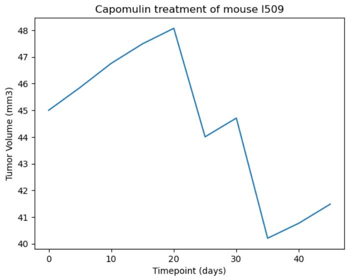
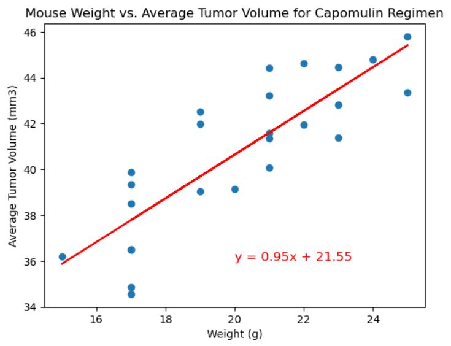

# Matplotlib-Challenge

## Introduction 
In this project, I analysed an animal study on potential skin cancer treatments. 249 mice received various regimens, observing tumor development over 45 days. My roles were to generate: tables, figures, and a summary.

Tasked with data prep, I merged mouse_metadata and study_results DataFrames. Identifying duplicates, I created a clean DataFrame. Generating statistics, I calculated mean, median, variance, SD, and SEM for each drug regimen. Bar charts display row counts per regimen using both Pandas and Matplotlib. I also visualised gender distribution through pie charts.

For four treatment regimens (Capomulin, Ramicane, Infubinol, Ceftamin), I calculated final tumor volume, quartiles, IQR, and potential outliers. I created box plots to highlight outliers. A line plot showcases tumor volume over time for a specific mouse treated with Capomulin. A scatter plot reveals the correlation between mouse weight and tumor volume. Lastly, I calculated the correlation coefficient and plot a linear regression model for mouse weight and tumor volume.

## Source of Data
Within data folder in Pymaceuticals folder:
* Mouse_metadata.csv
* Study_results.csv

## Findings

### Summary Statistics

This table presents summary statistics for tumor volume based on different drug regimens. Each row corresponds to a specific drug regimen, and the columns represent various statistical measures:

1. Mean Tumor Volume: The average tumor volume for each drug regimen.
2. Median Tumor Volume: The middle value of tumor volume for each drug regimen.
3. Tumor Volume Variance: The variability of tumor volume values within each drug regimen.
4. Tumor Volume Std. Dev.: The standard deviation of tumor volume, indicating the spread of data around the mean.
5. Tumor Volume Std. Err.: The standard error of the mean, representing the uncertainty in the calculated mean.
   
For instance, looking at the "Capomulin" row:
- Mean Tumor Volume: 40.676
- Median Tumor Volume: 41.558
- Tumor Volume Variance: 24.948
- Tumor Volume Std. Dev.: 4.995
- Tumor Volume Std. Err.: 0.329

Comparing the effects of different drug regimens on tumor growth involves considering the mean tumor volume, which gives us an idea of the typical tumor size for each treatment. The median tumor volume is important because it's less sensitive to extreme values, providing a better representation of the central tendency of the data. We can gain insights into how different drug regimens affect tumor volumes. For instance, a lower mean and median, along with lower standard deviation and SEM, could indicate a more effective treatment in terms of reducing tumor size and keeping the sizes consistent. On the other hand, larger standard deviations and SEMs might suggest more variability and uncertainty in the treatment outcomes.

These statistics allow us to compare how tumor volumes behave under various drug regimens, understanding the average size, variability, and distribution of the tumors. This information aids in assessing the effectiveness of different treatments on tumor growth.

## Bar Chart

The bar plot showing the total number of timepoints for all mice tested for each drug regimen visualizes the amount of data collected over time for each specific drug treatment. Each drug regimen is represented on the x-axis, and the corresponding number of timepoints (measurements taken at different intervals) is depicted on the y-axis. This bar chart is important because it provides an understanding of the data density and distribution over the course of the study for each drug regimen. It helps us answer questions such as:

1. Data Collection Consistency: A consistent distribution of timepoints across different drug regimens suggests that the study was conducted rigorously and that each treatment group has a comparable amount of data. Inconsistent distributions might raise concerns about the reliability of the study's conclusions.
2. Treatment Duration: The chart can show whether all regimens had a similar duration for data collection. If some regimens have a significantly higher number of timepoints, it could indicate that the study lasted longer for those treatments, which could influence the analysis and conclusions.
3. Comparison of Regimens: By comparing the number of timepoints, we can assess which regimens were monitored more frequently and consistently. This could influence the reliability of observations and the effectiveness of the treatment.

The fact that the drug regimen 'Capomulin' has the highest number of timepoints while 'Propriva' has the lowest indicates 'Capomulin' to be a potential candidate that showed promising results (as shown in the statistic table above), prompting researchers to closely monitor its effects over time. On the other hand, 'Propriva' had fewer timepoints due to its lower perceived efficacy or less promising preliminary results.

## Pie Chart

The distribution of male and female mice is important because it provides insights into the composition of the study population and potential gender-related impacts on the research outcomes. Here's why the 51% male and 49% female distribution is significant:

1. Baseline Characteristics: Understanding the gender distribution ensures that the study is representative of both male and female mice, which are common in many preclinical studies. This helps in extrapolating the study results to a broader population.
2. Biological Differences: In certain medical conditions, such as cancer, there might be biological differences between genders in terms of susceptibility, disease progression, and response to treatment. An equal gender distribution allows researchers to analyze potential gender-specific effects.
3. Research Implications: If there's an imbalance in gender distribution, it could lead to biased results. For example, if there are more males than females, any observed effects might be specific to males and not applicable to females, and vice versa.
4. Clinical Relevance: The gender distribution also informs the relevance of the study findings to human patients. Understanding how different genders respond to treatments can influence clinical decisions in the future.
5. Regulatory Considerations: Regulatory bodies often require that preclinical studies have balanced gender distributions to ensure unbiased outcomes and to avoid overlooking potential gender-specific effects.
6. Data Interpretation: If the gender distribution is heavily skewed, it's important to consider the limitations in generalising the results to diverse populations, including both genders.

The 51% male and 49% female distribution is crucial for ensuring the study's validity, generalizability, and applicability to both genders, which is particularly important for cancer research where gender-related differences might impact treatment outcomes.

## Box Plot

The box plots and associated statistics offer a visual representation of the spread and distribution of tumor volumes across different drug regimens. The IQR gives insight into the range where the majority of tumor volumes fall, while the presence of potential outliers helps identify data points that significantly deviate from the general trend. Overall, these findings provide essential information for evaluating the effectiveness of different drug regimens in managing tumor growth. The absence of potential outliers in Infubinol's data suggests a relatively more consistent distribution, while the presence of outliers in Capomulin, Ramicane, and Ceftamin points to variability in response to these treatments. Further analysis and investigation into these outliers could yield valuable insights into the treatment efficacy and potential factors influencing tumor volume variation.

## Line Plot

The line plot of tumor volume vs. time point for a mouse treated with Capomulin provides a visual representation of how the tumor volume changes over the course of the treatment. The observation that the tumor volume initially increases and then experiences a significant decrease holds important implications for understanding the effectiveness of the Capomulin treatment.
#### Significance:

1. Treatment Response: The rising tumor volume in the initial days indicates that the tumor might have been growing or not responding effectively to the treatment at the beginning. This could be due to various factors such as the tumor's inherent resistance or the treatment's lag in taking effect.
2. Therapeutic Efficacy: The dramatic fall in tumor volume at day 34 signifies a positive response to the treatment. This reduction suggests that the Capomulin treatment started to effectively inhibit the tumor's growth, leading to a decrease in its size.
3. Optimal Time for Evaluation: The observed peak at day 19 and subsequent decline highlight the importance of evaluating the treatment's efficacy over time. This pattern suggests that a comprehensive assessment should consider the initial growth, any potential plateau, and eventual reduction in tumor volume to accurately determine the treatment's impact.
4. Individual Variation: The plot underscores the variability in individual response to the treatment. Different mice may exhibit distinct patterns, indicating the need for personalised treatment strategies and continuous monitoring to adjust interventions as needed.
5. Decision-Making: This type of plot aids medical professionals and researchers in making informed decisions about treatment courses. The observed response pattern can inform adjustments to the treatment plan, dosages, or combination therapies to maximise positive outcomes.

The line plot highlights the dynamic nature of tumor volume changes in response to Capomulin treatment. It demonstrates the complex interplay between treatment efficacy, individual variation, and the importance of time in assessing therapeutic outcomes. This information guides medical professionals in understanding the progression of treatment and aids in refining patient-specific approaches for managing cancer.

## Scatter Plot

The correlation coefficient of 0.84 between mouse weight and average tumor volume for the Capomulin regimen indicates a strong positive correlation between these two variables. This finding has important implications in understanding the relationship between mouse weight and tumor volume in response to the Capomulin treatment.

#### Interpretation:

1. Positive Correlation: A correlation coefficient of 0.84 suggests that as mouse weight increases, the average tumor volume tends to increase as well. In other words, larger mice within the Capomulin regimen generally have larger tumor volumes. This relationship is termed positive correlation, where both variables move in the same direction.
2. Strength of Correlation: The correlation coefficient being close to 1 (the maximum value) indicates a strong positive relationship. This means that the change in mouse weight is closely related to the change in average tumor volume.

#### Importance:

1. Treatment Response: The positive correlation suggests that larger mice may be more prone to developing larger tumor volumes. This could be due to various factors such as metabolic rates, genetic predisposition, or the way the drug interacts with different body sizes. Understanding this correlation can help tailor treatment plans and dosages to account for individual variability.
2. Predictive Capability: The correlation can be used to make predictions about tumor volume based on mouse weight. While correlation does not imply causation, it can still provide a general guideline for expected tumor volume changes based on changes in mouse weight.
3. Personalised Treatment: Medical professionals can use this information to assess whether certain mice within the Capomulin regimen might need additional interventions, altered dosages, or more frequent monitoring based on their weight and expected tumor volume response.
4. Research Insights: This correlation can provide insights into the biological mechanisms underlying tumor growth and how they interact with the drug's effects. Further research can delve into these mechanisms to enhance the understanding of treatment outcomes.

The strong positive correlation between mouse weight and average tumor volume within the Capomulin regimen suggests that larger mice tend to have larger tumor volumes. This finding is crucial for tailoring treatment strategies, predicting outcomes, and gaining insights into the complex relationship between variables in cancer treatment research.

## Conclusion
The Capomulin and Ramicane drug regimens appear to be the most effective at reducing tumour volume in mice, as they had the lowest average final tumour volumes and the lowest tumour volume variance shown in the boxplot graph.Infubinol and Ceftamin regimens, on the other hand, had larger average final tumour volumes and greater tumour volume variance. Also, for the Capomulin regimen, the scatter plot of average tumour volume vs. mouse weight reveals a strong positive correlation between mouse weight and average tumour volume. The correlation coefficient (r) of 0.84 indicates that these variables have a significant positive relationship. Finally, for the Capomulin regimen, the linear regression plot for mouse weight and average tumour volume demonstrates that as mouse weight increases, so does average tumour volume. This indicates that mouse weight could influence tumour volume. Overall, these findings indicate that the Capomulin and Ramicane drug regimens are more successful in decreasing tumour volume in mice, and that controlling for mouse weight is essential when interpreting preclinical study results.

## Data Dictionary
1. **Mean** (Average): This column indicates the average tumor volume for each drug regimen. It gives an overall idea of the typical size of tumors under different treatments.
2. **Median**: The median tumor volume is the middle value in a set of tumor volumes sorted in ascending order. It's a measure of central tendency and is less influenced by outliers compared to the mean.
3. **Variance**: Variance measures the extent to which tumor volumes differ from the mean. A larger variance suggests greater variability among tumor sizes within a regimen.
4. **Standard Deviation**: This value indicates the spread or dispersion of tumor volumes around the mean. A higher standard deviation means more variability in tumor sizes.
5. **Standard Error of the Mean** (SEM): SEM quantifies the precision of the sample mean as an estimate of the population mean. It provides an estimate of how much the sample mean might vary from the true population mean.
