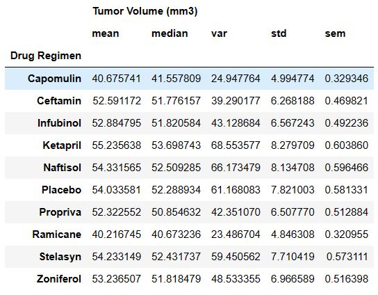
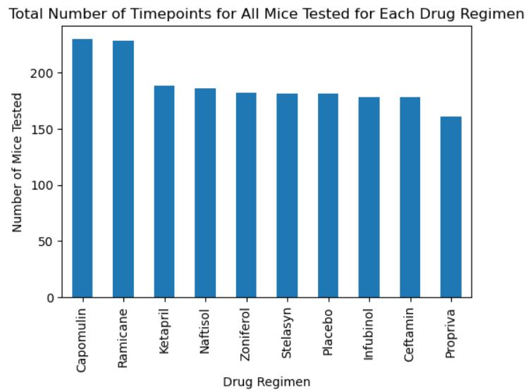
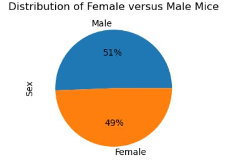

# Matplotlib-Challenge

## Introduction 
In this project, I analysed an animal study on potential skin cancer treatments. 249 mice received various regimens, observing tumor development over 45 days. My roles were to: generate tables, figures, and a summary.

Tasked with data prep, I merged mouse_metadata and study_results DataFrames. Identifying duplicates, I created a clean DataFrame. Generating statistics, I calculated mean, median, variance, SD, and SEM for each drug regimen. Bar charts display row counts per regimen using both Pandas and Matplotlib. I also visualised gender distribution through pie charts.

For four treatment regimens (Capomulin, Ramicane, Infubinol, Ceftamin), I calculated final tumor volume, quartiles, IQR, and potential outliers. I created box plots to highlight outliers. A line plot showcases tumor volume over time for a specific mouse treated with Capomulin. A scatter plot reveals the correlation between mouse weight and tumor volume. Lastly, I calculated the correlation coefficient and plot a linear regression model for mouse weight and tumor volume.

## Source of Data
Within data folder in Pymaceuticals folder:
* Mouse_metadata.csv
* Study_results.csv

## Findings

This table presents summary statistics for tumor volume based on different drug regimens. Each row corresponds to a specific drug regimen, and the columns represent various statistical measures:

1. Mean Tumor Volume: The average tumor volume for each drug regimen.
2. Median Tumor Volume: The middle value of tumor volume for each drug regimen.
3. Tumor Volume Variance: The variability of tumor volume values within each drug regimen.
4. Tumor Volume Std. Dev.: The standard deviation of tumor volume, indicating the spread of data around the mean.
5. Tumor Volume Std. Err.: The standard error of the mean, representing the uncertainty in the calculated mean.
   
For instance, looking at the "Capomulin" row:
Mean Tumor Volume: 40.676
Median Tumor Volume: 41.558
Tumor Volume Variance: 24.948
Tumor Volume Std. Dev.: 4.995
Tumor Volume Std. Err.: 0.329

Comparing the effects of different drug regimens on tumor growth involves considering the mean tumor volume, which gives us an idea of the typical tumor size for each treatment. The median tumor volume is important because it's less sensitive to extreme values, providing a better representation of the central tendency of the data. These statistics allow us to compare how tumor volumes behave under various drug regimens, understanding the average size, variability, and distribution of the tumors. This information aids in assessing the effectiveness of different treatments on tumor growth.

